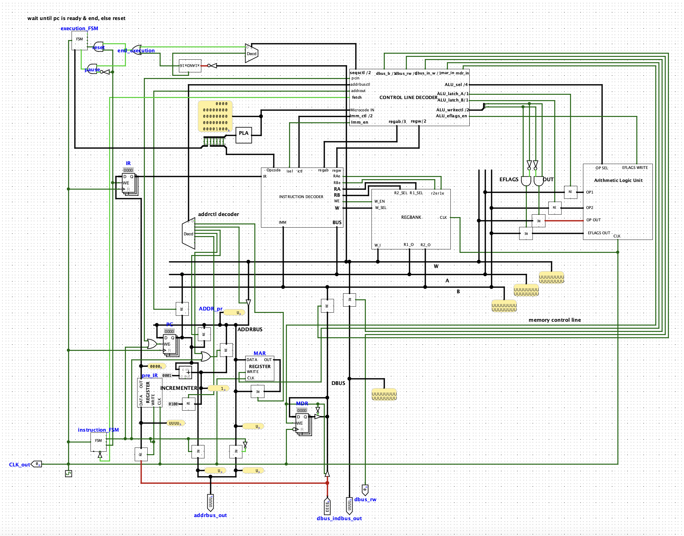
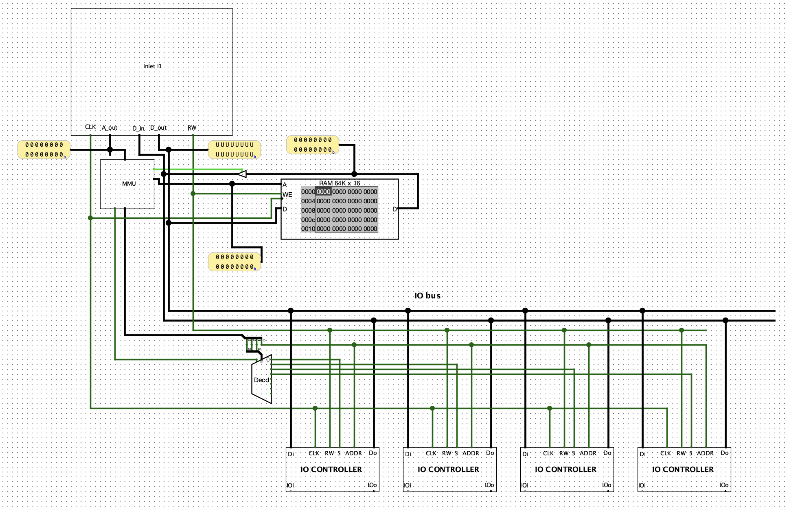
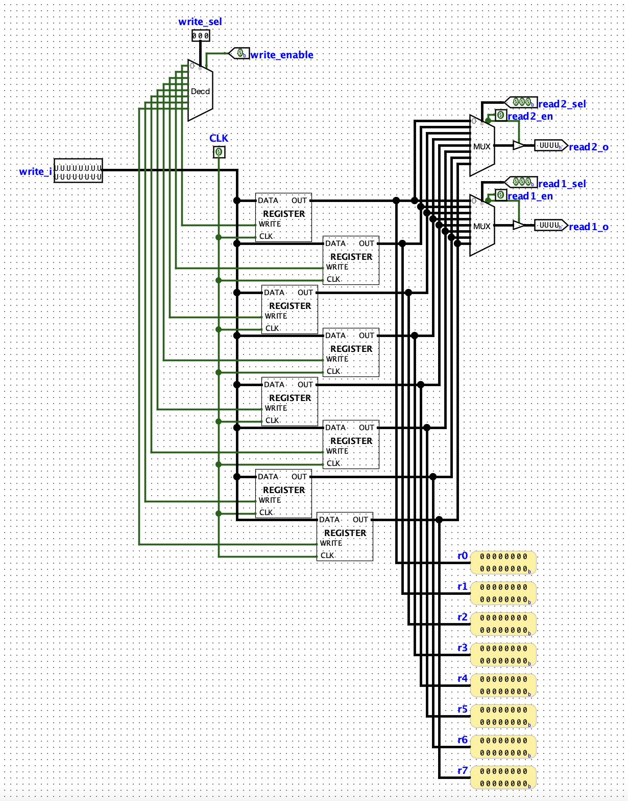
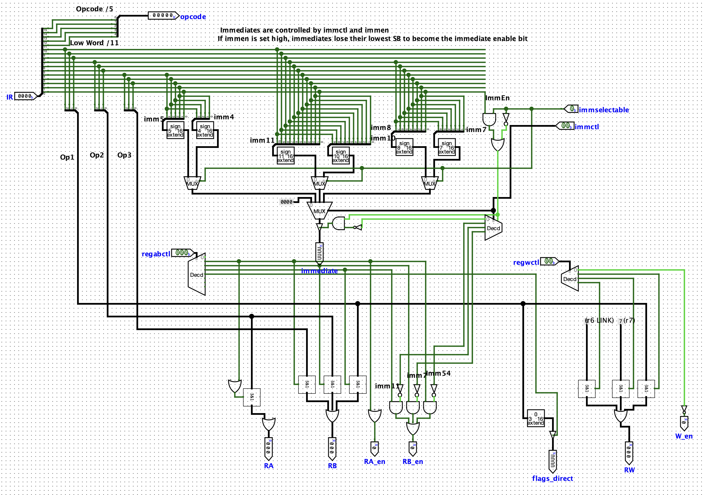

# ARMv1-like 16-bit CPU in Logisim

A (technically superscalar) 16-bit microprocessor implementation inspired by the ARM1 architecture, with a microcode control unit, a custom instruction set, and a full development toolchain built from scratch. Made for a university project with my good friend [Pavel Kuznetsov](https://github.com/Fruerdd).



## Key Features

- 16-bit RISC-like Architecture with 8 general-purpose registers
- Control Unit with 36-bit microcode control words
- Multi-Bus Design inspired by armv1 documentation available online (A bus, B bus, Write bus, Address bus)
- Development toolchain:
  - Microcode assembler (C++)
  - Assembly language assembler (TypeScript/Node.js)
- Support for a lot of RISC and some CISC instructions
- Simple Memory-Mapped I/O with an MMU



## Architecture

### Registers

- **R0-R7**: 8 general-purpose 16-bit registers
- **R6**: Stack Pointer (by convention)
- **R7**: Link Register for CALL/RET operations
- **PC**: Program Counter (16-bit)
- **IR**: Instruction Register (16-bit)
- **EFLAGS**: Status flags (currently only Negative, Zero and Positive)




### Instruction Format

The CPU has multiple instruction formats for different operation types:

#### A variant (Three-operand ALU operations)
```
[15:11] Opcode (5 bits)
[10:8]  Dr  - Destination register (3 bits)
[7:5]   Sr1 - Source register 1 (3 bits)
[4:2]   Sr2 - Source register 2 (3 bits) OR Imm5[4:2]
[2:0]   Reserved / Imm5[1:0]
```

#### B variant (Two-operand operations)
```
[15:11] Opcode (5 bits)
[10:8]  Op1 (3 bits)
[7:0]   Imm8 - 8-bit immediate/offset
```

#### C variant (Long immediate operations)
```
[15:11] Opcode (5 bits)
[10:0]  Imm11 - 11-bit immediate
```

#### D variant (Whatever you would call this)
```
[15:11] Opcode (5 bits)
[10:8]  XYZ - written directly to A ALU bus (used for BRnzp)
[7:0]   Imm11 - 11 bit immediate
```




### Instruction Set

The implementation is currently incomplete. Some instructions exist in `./uassembler/microcode.cpp`, i.e. most ALU instructions, BRnzp, and store and load instructions. Below is a table of instructions that the CPU architecture itself would be able to support.

| Category | Instructions | Description |
|----------|-------------|-------------|
| **Arithmetic** | ADD, SUB, MUL | Integer arithmetic operations |
| **Logical** | AND, OR, XOR | Bitwise logical operations |
| **Shift** | LSR, ASR, ASL | Logical/arithmetic shift left/right |
| **Data Movement** | MOV, LD, ST, LDI, STI | Register and memory transfers |
| **Control Flow** | BR, JMP, CALL, RET | Conditional/unconditional branches |
| **Stack** | PUSH, POP | Stack operations using R6 |
| **System** | INT | Interrupt/trap handling |

### Microcode Architecture

The CPU uses a microcoded control unit with 36-bit control words organized into functional groups:

- **Sequence Control** (2 bits): END, NEXT, conditional execution
- **Control Signals** (5 bits): PC control, fetch, address bus control
- **Register Control** (7 bits): Register select for A/B buses, write control
- **Immediate Control** (4 bits): Immediate value extraction and multiplexing
- **ALU Control** (10 bits): Operation select, latch control, flag management
- **Memory Control** (8 bits): Data bus, MAR/MDR control, read/write

Each instruction can execute over multiple microcode steps, which enables memory access and conditional branching (i.e. compare nzp, then PC + Imm).


## Hardware Implementation

### Major Components

The Logisim circuit includes a bunch of custom subcircuits:

#### Processing Components
- **ALU**: Full 16-bit arithmetic logic unit
  - Dedicated circuits for AND, OR, XOR operations
  - 16-bit adder with carry propagation
  - 16-bit multiplier using shift-and-add
  - Barrel shifter for LSR/ASR/ASL operations
- **GPREG_BANK**: 8-register general-purpose register file with dual-port read, single-port write
- **x16Multiplier**: Hardware multiplier implementation - not used in ALU because LogiSim default components are more stable.
- **x16Shifter**: Configurable barrel shifter

#### Control Components
- **ExecutionFSM**: Finite state machine managing instruction execution phases with 4 states
- **CU_DECODER**: Microcode decoder extracting control signals
- **CU_instructiondecoder**: Instruction opcode decoder

#### Memory Components
- **MMU**: Memory Management Unit for address translation
- **RAM**: 16-bit addressable memory (64KB address space)

#### I/O Components
- **IO_controller**: Memory-mapped I/O interface
- **IO_display_controller**: Display output management - not complete atm

### Control Flow

1. **Fetch Phase**: PC -> Address Bus -> Memory -> IR, PC++
2. **Decode Phase**: IR[15:11] -> Ucode FPGA -> Control Signals
3. **Execute Phase**: Multi-cycle execution based on microcode sequence - i.e. a variable number of microinstructions
4. **Writeback Phase**: Results written to registers/memory

Additionally, instructions are prefetched in multi stage instructions as soon as the instruction microcode signals the `fetch` line. Technically making this CPU superscalar.

## Development Tools

### 1. Microcode Assembler (C++)

Located in `uassembler/microcode.cpp`, this program generates microcode ROM contents.
The program generates a txt output file to be imported into the FPGA in logisim.

**Build and run:**
```bash
cd uassembler
g++ -std=c++20 microcode.cpp -o microcode
./microcode > ucode.txt
```

**Output format:**
```
[opcode:5][sequence:2] [control_word:36]
```

### 2. Assembly Language Assembler (TypeScript)

Located in `assembler/assembler.ts`, converts assembly programs to machine code.
The assembler read an input assembly file, performs register resolution & immediate encoding, converts mnemonics to opcodes and outputs the complete assembled binary. Not all microcoded instructions are currently in it.

**Setup and run:**
```bash
cd assembler
pnpm install
pnpx tsc assembler.ts
node assembler.js
```

**Input format** (assembly.txt):
```asm
mov r1, #3
sub r1, r1, #2
add r2, r1, r1
st r2, #100
```

**Output:** Hexadecimal machine code in `assembly_OUT.txt`

## Example Programs

### Simple Arithmetic
```asm
mov r1, #5          ; Load immediate value 5 into r1
mov r2, #3          ; Load immediate value 3 into r2
add r3, r1, r2      ; r3 = r1 + r2 (r3 = 8)
sub r4, r3, #1      ; r4 = r3 - 1 (r4 = 7)
```

### Memory Operations
```asm
mov r1, #42         ; r1 = 42
st r1, #100         ; Store r1 to memory address 100
ld r2, #100         ; Load from memory address 100 into r2
```

### Conditional Branching
```asm
mov r1, #5
sub r1, r1, #5      ; Sets zero flag
br nzp, #10         ; Branch based on condition flags
```

## Usage

### Running in Logisim

1. Install [Logisim-evolution](https://github.com/logisim-evolution/logisim-evolution) (min ver v3.8.0 I think)
2. Open `cpu16.circ`
3. Navigate to the `CPU` or `main` circuit
4. Load program ROM with assembled machine code
5. Load microcode ROM with generated microcode (`ucode.txt`)
6. Start simulation and step through or run continuously

### Building the Toolchain

## Technical Specifications

| Specification | Value |
|--------------|-------|
| Data Width | 16 bits |
| Address Space | 64KB (16-bit addressing using register) |
| Registers | 8 general-purpose |
| Instruction Length | 16 bits (fixed) |
| Microcode Word Size | 36 bits |
| Clock Frequency | Configurable (512 Hz default in simulation) |
| ALU Operations | 10 (AND, OR, XOR, ADD, SUB, IMUL, LSR, ASR, ASL, NOT, CMP) |

## Project Structure

```
armlikecpu/
├── cpu16.circ              # Main Logisim circuit file (9829 lines)
├── docs/                   # General documentation stuff
│   ├── isa.txt             # Instruction set specification notes that i wrote out while making it
│   ├── notes.txt           # Architecture design notes. Very unorganized at the moment
│   ├── references.txt      # Reference materials and inspiration
├── assembler/
│   ├── assembler.ts        # TypeScript assembler code
│   ├── assembly.txt        # Sample assembler output
├── uassembler/
│   ├── microcode.cpp       # Cpp microassembler code
│   └── ucode.txt           # Sample output microcode file
```

## Design Inspiration

This project draws inspiration from:

- **ARM1 Processor** (1985): Multi-bus architecture, register bank design
- **RISC Philosophy**: Simple, regular instruction encoding
- **Classic Microprocessors**: Microcoded control, multi-cycle execution

Key references:
- [Reverse Engineering the ARM1 Processor](https://www.righto.com/2016/02/reverse-engineering-arm1-processors.html)
- ARM Architecture Reference Manual (historical)
- Classic computer architecture textbooks

## Future Enhancements

Potential improvements and extensions:

- [ ] Pipeline implementation for improved throughput
- [ ] Cache hierarchy (L1 instruction/data cache)
- [ ] Interrupt controller and exception handling
- [ ] Floating-point unit (FPU)
- [ ] Memory protection and privilege levels
- [ ] Debugger and single-step execution interface
- [ ] C compiler backend (LLVM/GCC target)
- [ ] FPGA synthesis and physical implementation

## License

This is an educational project. Feel free to use, modify, and learn from it.